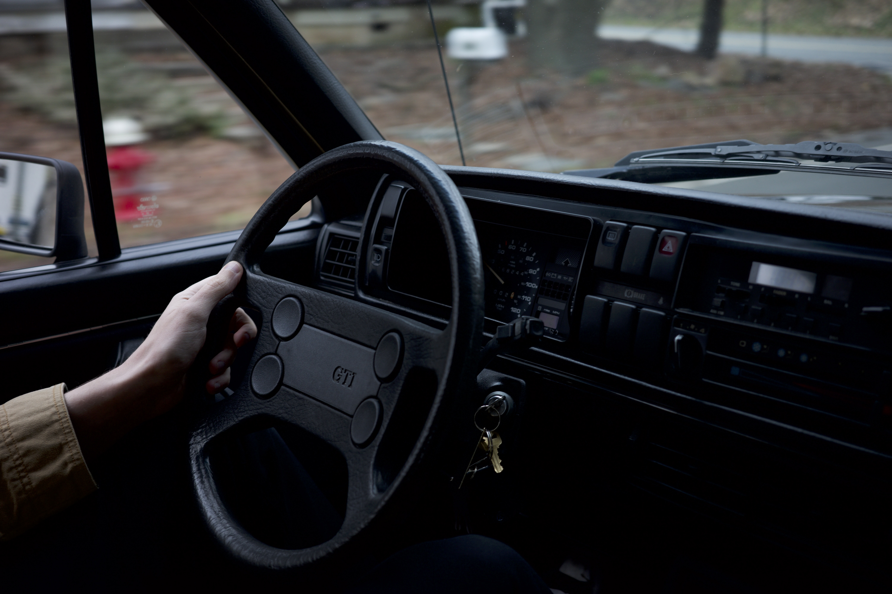
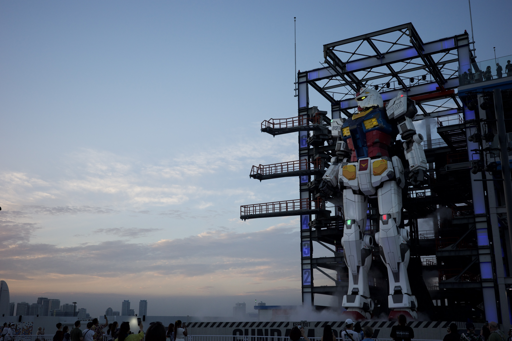

I was gifted a [RICOH GR IIIx](https://www.bhphotovideo.com/c/product/1664769-REG/ricoh_15286_gr_iiix_digital_camera.html) for christmas by the lovely [@nietzschesandcream](https://www.instagram.com/nietzschesandcream/) and it has fast become my favorite piece of kit. Over the last decade I have hopped between ecosystems lusting over lenses and struggled to have the correct tool on me for the right moment. The simplistic Ricoh satisfes all that lust in a small focused form factor. The GR shouldn't take good photographs in this day and age of smart phones. But it does.

> A scenic romp in a 1986 VW GTI

I find that 40mm is perfectly suited to my needs. The static focal length allows me to focus on composition, framing, and making a distraction free image. Although this may sound similar to a smart phone the distraction free nature of the tool for the moment eliminates distractions.

## My Current Settings

> Last Updated `Monday, Feb 26, 2024`

My default settings 99% of the time. These are a good start but you should absolutely tune them for your needs.

_I tried to write these sequentially through the menus._

- I prefer _P_ or _Program Mode_ as I am able to have the camera do all the maths for me. If I can offload work to the camera I want it to select what it feels is “optimal” for aperture and shutter-speed within the initial parameters I have set. I want to worry about the moment.
- Use _Autofocus_ You are more likely to capture the moment you want. This is by far,  #1 priority in photography.
- AE Metering ~ (auto exposure metering): Highlight-Weighted
- File: JPEG / RAW - Don't shoot raw if you have zero intention of editing.
- Auto power off / Sleep mode: 30 minutes
- Volume: 0
- Customize settings: Instant review (OFF)
- Grid style: 4×4 Grid
- Shooting info display: Just turn on the grid guide (press DISP on the back-right button of the RICOH GR III/X to scroll through the display shooting modes)
- Image Control: Hi/BW (high contrast black and white): press FN button to customize Contrast +4, Contrast highlight/contrast shadows to +4, Sharpness +4, Grain Effect 3

## Gallery

> Gundam Factory Yokohama

> Tori Gates

## Sources

- [Ricoh Site](https://us.ricoh-imaging.com/product/griiix/)
