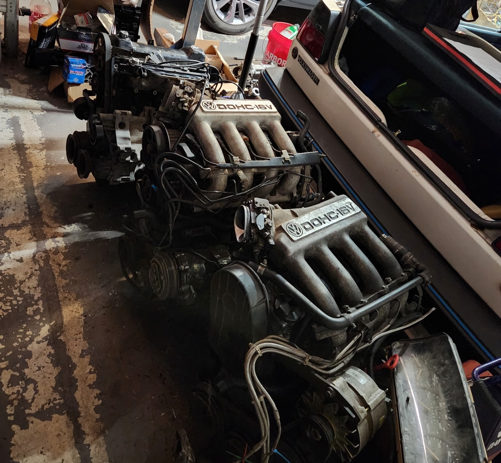

> Two blocks of Aspirational Horse Power provided by [@thomas_and_a_vw](https://www.instagram.com/thomas_and_a_vw/)

## Overview

Building a 9A 16v with modern fuel management and individual throttle bodies. The goal is maximizing NA sound while keeping the build relatively simple and the driving experience fun. CIS-E out, EFI + ITBs in.

## Bill of Materials

| Item | Status | Cost | Notes |
| ------ | -------- | ------ | ------- |
| VW 9A 16v 2.0 16v | Have | $300.00 | |
| Jenvey ITB Kit | Order | TBD | |
| Standalone ECU - MicroSquirt | Order | $379.99 | |
| High-flow fuel pump | | TBD | External pump setup |
| Fuel injectors (330cc) | | TBD | |
| Fuel pressure regulator | | TBD | |
| VW 02J transmission | | TBD | Source used |
| Exhaust header | Have | TBD | |
| Engine wiring harness | | TBD | |
| Fuel lines & fittings | | TBD | |
| Air filter & intake plumbing | | $0.00 | |

## Build Log

### 2026-07-12 – Motor Acquired

- Picked up the 9A block from [@thomas_and_a_vw](https://www.instagram.com/thomas_and_a_vw/) at **Mk1 Madness 2026**

### 2026-07-XX – TBD

- Placeholder

## Resources

- [Jenvey Throttle Body Kits](https://www.jenvey.co.uk/throttle-body-kits/vw/)
- [CAE Racing Short Shifters](https://cae-racing.com/en/short-shifter/)

## Notes

- **This is a living document**. Updates will be added as the build progresses.
- **Questions/gotchas**: TBD as they emerge.
