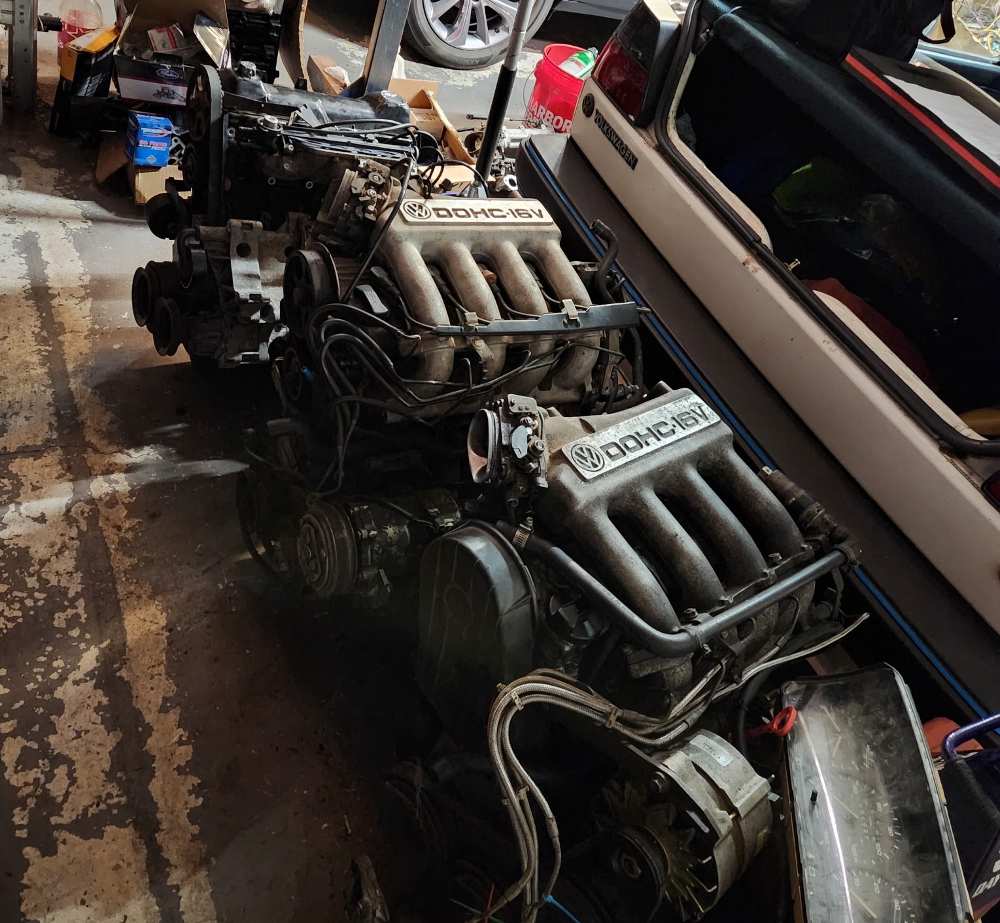

> Two blocks of Aspirational Horse Power provided by [@thomas_and_a_vw](https://www.instagram.com/thomas_and_a_vw/)

## Table of Contents

- [Overview](#overview)
- [Bill of Materials](#bill-of-materials)
- [Build Log](#build-log)
  - [2026-07-12 – Motor Acquired](#2026-07-12--motor-acquired)
  - [2026-09-21 – ITB Research](#2026-09-21--itb-research)
  - [2026-09-30 – ECU Research](#2026-09-30--ecu-research)
  - [2026-09-30 – Fuel Pressure Regulator & Fittings](#2026-09-30--fuel-pressure-regulator--fittings)
- [Resources](#resources)
- [Notes](#notes)

## Overview

Building a 9A 16v with modern fuel management and individual throttle bodies. The goal is maximizing NA sound while keeping the build relatively simple and the driving experience fun. CIS-E out, EFI + ITBs in.

## Bill of Materials

| Item | Status | Cost | Notes |
| ------ | -------- | ------: | ------- |
| VW 9A 16v 2.0 16v | Have | $300.00 | |
| ITB Kit | Researching | TBD | Deciding between AT Power, Jenvey, OBX, US Rally Team |
| Standalone ECU | Researching | TBD | Leaning Haltech Nexus T1 over Link AtomX and MicroSquirt |
| High-flow fuel pump | | TBD | External pump setup |
| Fuel injectors (330cc) | | TBD | |
| Fuel pressure regulator | Researching | TBD | Radium DMR vs FPR-D — depends on ITB kit's fuel rail port |
| VW 02J transmission | | TBD | Source used |
| Exhaust header | Have | TBD | |
| Engine wiring harness | | TBD | |
| Fuel lines & fittings | Researching | TBD | Radium AN fittings, sizing depends on rail/FPR choice |
| Air filter & intake plumbing | | $0.00 | |

## Build Log

### 2026-07-12 – Motor Acquired

- Picked up the 9A block from [@thomas_and_a_vw](https://www.instagram.com/thomas_and_a_vw/) at **Mk1 Madness 2026**

### 2026-09-21 – ITB Research

Haven't pulled the trigger on throttle bodies yet. Four options on the table, and each one's pulling me in a different direction:

| Option | Bore | Price | Lead Time |
| ------ | ---: | ----: | --------: |
| [AT Power](https://atpower.com/product/volkswagen-16v-abf-kr-9a-45mm-electronic-fuel-injection-efi-throttle-bodies-itb-s/) | 45mm | £1,495–£2,685 +VAT | 8-9 weeks |
| [Jenvey DTH kit](https://www.jenvey.co.uk/throttle-body-kits/vw/volkswagen-dth-kit-ckvw01-kit) | 45mm | £1,081 inc VAT | Made to order |
| OBX/Becker (eBay) | 45mm | TBD | In stock |
| [US Rally Team (TA Technix)](https://usrallyteam.com/index.php?main_page=product_info&products_id=3472) | 40mm | $1,449 | TBD |

Jenvey's the known quantity — it's the kit most of the 16v crowd actually runs, so fitment and documentation are a non-issue. AT Power is the expensive outlier, but it's the only one of the four offering drive-by-wire, which would let me skip a cable throttle linkage entirely. OBX is the tempting "just buy it, it's in stock and cheap" option, but there's no install guide and I don't know the brand, so I'd be on my own if something's off. US Rally Team's 40mm bore is smaller than the other three — not sure yet if that's a meaningful tradeoff for this displacement or just a different philosophy.

Leaning AT Power right now for the drive-by-wire alone, but haven't convinced myself it's worth the 2x price and 2-month wait over Jenvey.

### 2026-09-30 – ECU Research

Started second-guessing the MicroSquirt that's been sitting in the BOM since the start, so I looked at what else is out there.

| Option | Injector/Ignition Drives | Price |
| ------ | ------------------------ | ----: |
| [Haltech Nexus T1](https://www.haltech.com/product/ht-210000-nexus-t1-ecu/) | 4 / 4 | $935 |
| [Link G4X AtomX](https://dealers.linkecu.com/G4X-AtomX) | 4 / 4 | Not published — reseller only |
| [MicroSquirt](https://diyautotune.com/products/microsquirt?srsltid=AU7gw4WC7tO7m_MBuzN3g1HcwEA_v89s_KJChMXyWqnXBwE_vPSEwseh) | 4 / 4 | $379.99 |

First thing that stood out: Link doesn't publish pricing anywhere, you have to go through a reseller to get a number, which makes it hard to compare apples-to-apples against Haltech's sticker price. AtomX is the right size for the 9A, but without a published price I can't tell yet if it actually beats Haltech on cost.

MicroSquirt is still the budget anchor at $380 — mostly known for being DIY and community-tuned rather than having polished factory software. Haltech's Nexus T1 is where I'm leaning mainly because the price is upfront and it's sized correctly for 4 cylinders, but I haven't yet decided if the jump from MicroSquirt is worth it or if I'm just paying for nicer software.

### 2026-09-30 – Fuel Pressure Regulator & Fittings

Looking at [Radium Engineering](https://www.radiumauto.com/) for the FPR and AN fittings — their parts keep showing up as the reference point in other EFI swap builds I've read through. Two regulators actually fit this build:

- **[DMR](https://www.radiumauto.com/products/dmr-ra-direct-mount-regulator)** ($170.95) — mounts straight into an 8AN ORB fuel rail port, no extra plumbing. Only works if the fuel rail (whatever comes with the ITB kit) actually has that port.
- **[FPR-D](https://www.radiumauto.com/products/fprd-ra-fuel-pressure-regulator-damper)** ($299.95) — standalone, universal, and has a built-in fuel pulse damper. That damper matters more here than it would on a stock intake — ITBs mean each cylinder's injector pulls from a shorter, less-buffered section of rail, so pressure pulses are more likely to show up as a rough idle or uneven cylinders.

There's also a **DFPR** (dual regulator, ~$299.95), but that's built for staged port+direct-injection setups — not applicable to a single-stage port-injected ITB engine, so that one's ruled out.

Haven't picked between DMR and FPR-D yet — it depends on whether the fuel rail that ships with the ITB kit has a port the DMR can thread into, or whether I'll need the FPR-D's inline flexibility regardless. Fittings themselves (AN sizes, adapters) also come from Radium's universal lineup, but those depend on whatever rail/regulator combo wins out, so that's still open too.

## Resources

- [Jenvey Throttle Body Kits](https://www.jenvey.co.uk/throttle-body-kits/vw/)
- [CAE Racing Short Shifters](https://cae-racing.com/en/short-shifter/)
- [Mission Motorwerks](https://www.missionmotorwerks.com/) – engine machine shop

## Notes

- **This is a living document**. Updates will be added as the build progresses.
- **Questions/gotchas**: TBD as they emerge.
