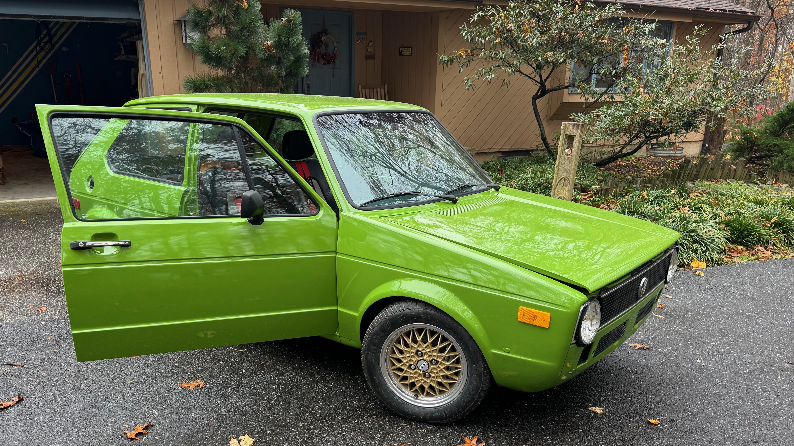
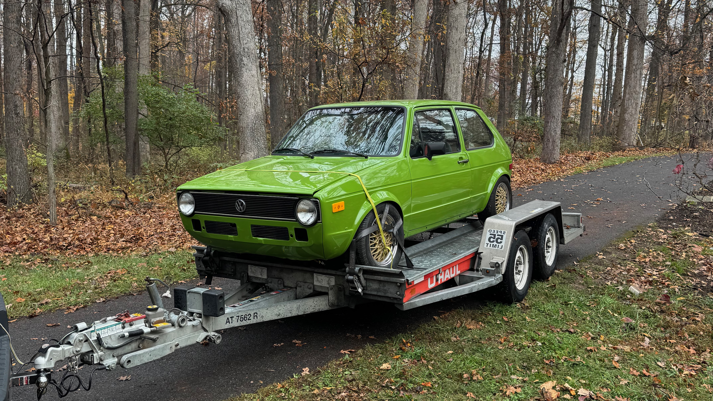

This is a living build thread. The first entries are retrospective until the log catches up with the current state of the car. Consider this a best effort build log.

## Index

- [The inspiration](#the-inspiration)
- [The find](#the-find)
- [The starting point](#the-starting-point)
- [The plan](#the-plan)
- [Build updates](#build-updates)

## Inspiration

### Jes and Kris Clewell's Mk1 Rabbit

[StanceWorks: Jes and Kris Clewell's 1980 Volkswagen Mk1 Rabbit](https://stanceworks.com/2015/01/jes-clewells-volkswagen-mk1-rabbit/)

<!-- Stub: Color, presence, fitment, height, and general aesthetic. -->

### SCI Performance's Bali Green Mk1

The previous owner was in pursuit of making a clone of the SCI performance golf. It was featured in PVW with it's bali green paint and green vw plaid. Accents he had added to the build



> PVW-featured Bali Green Mk1 built by Chad of SCI Performance in Minneapolis, Minnesota. [SCI Performance's Bali Green 1.8T Mk1 Rabbit](https://vimeo.com/6936718)

<!-- Stub: What this car contributed to the direction of the build. -->

### Why a Rabbit

<!-- Stub: Angular, pragmatic, simple, and why those qualities matter. -->

### Why "Bali-ish"

<!--
Stub: The original Bali Green (Baligrün), paint code L62A, was offered on
1977–1979 Rabbits. Explain where this car's color matches or differs.
-->

## The find

> **Retroactive post** — <!-- Stub: Original purchase date and location. -->

### The listing

[1979 Volkswagen Rabbit Hatchback 2D](https://www.facebook.com/marketplace/item/828484836592968)

<!-- Stub: Where the listing appeared, what it claimed, and first impressions. -->

<!-- Stub: First in-person inspection and the decision to buy it. -->

> Can you believe they let anyone rent these?!

<!-- Stub: The trip home. -->

## The starting point

### The good

- <!-- Stub -->

### The bad

- <!-- Stub -->

### The unknown

- <!-- Stub -->

## The plan

> **Version 1** — <!-- Stub: Date this version of the plan. -->

### Exterior and body

- <!-- Stub -->

### Suspension, height, and fitment

- <!-- Stub -->

### Wheels and tires

- <!-- Stub -->

### Engine and drivetrain

- <!-- Stub: Link to the engine or engine project. -->

### Interior

- <!-- Stub -->

### Intended use

- <!-- Stub -->

## Build updates

<!--
Copy this block for each update:

### YYYY-MM-DD — Update title

**Mileage:**

#### What changed

-

#### Parts

-

#### Problems / discoveries

-

#### Next

-

-->

### 2026-07-18 — Started the build thread

- **Time:** 21:59 UTC
- **Daybook:** Started project documentation.
