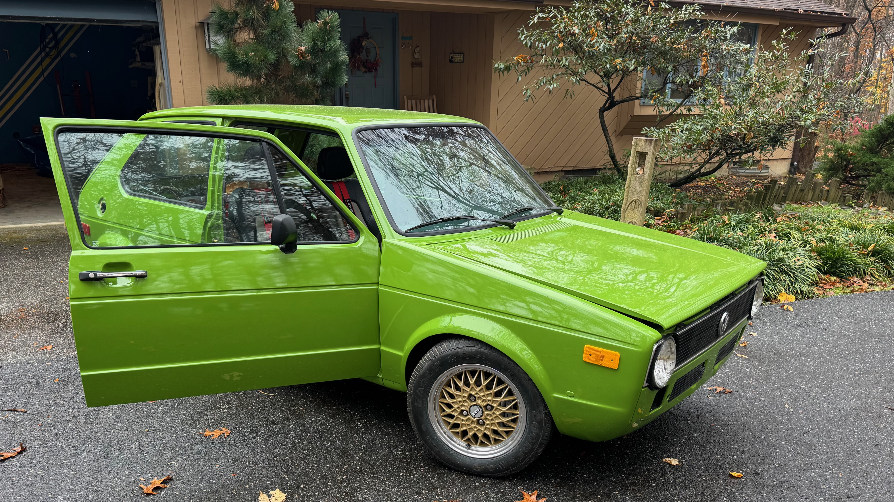
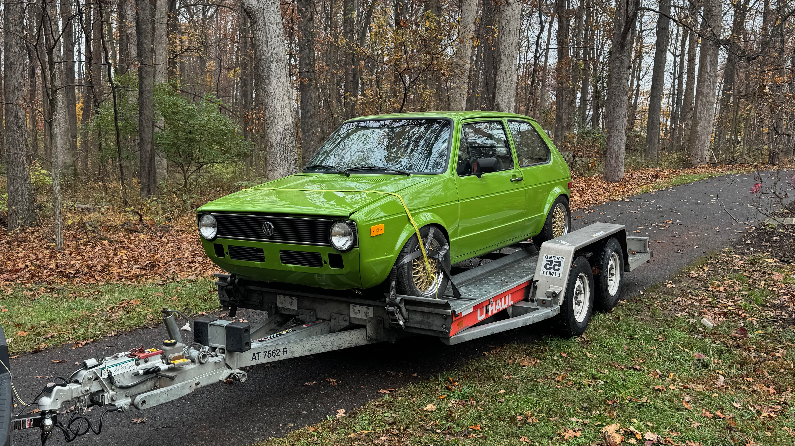
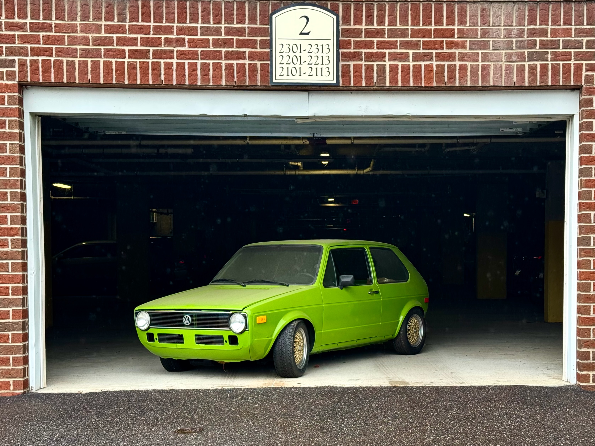
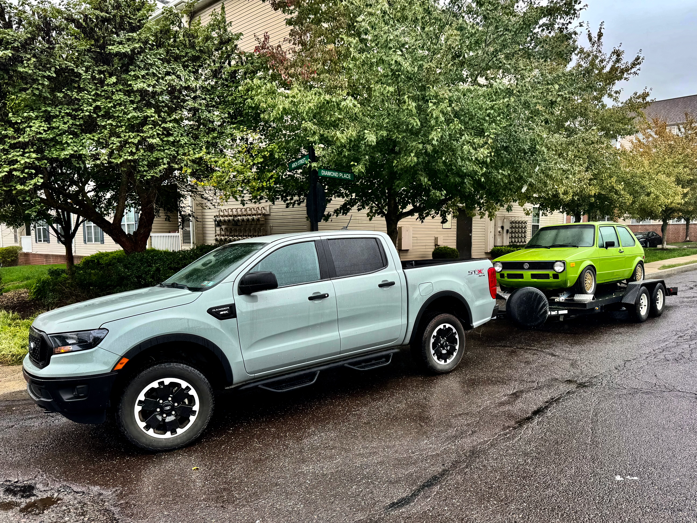

The first entries are retrospective until the log catches up with the current state of the car. Consider this a best effort build log.

## Table of Contents

- [Inspiration](#inspiration)
- [The listing](#the-listing)
- [Fabrication](#fabrication)

## Inspiration

Green Rabbits.

### [Jes and Kris Clewell's Mk1 Rabbit - StanceWorks Feature](https://stanceworks.com/2015/01/jes-clewells-volkswagen-mk1-rabbit/)

### [Jamie Fagan's 4 door](https://www.instagram.com/_jamiefagan_/)

### [SCI Performance's Bali Green Mk1](https://vimeo.com/6936718)

The previous owner's vision was to make a clone of the SCI performance golf. It was featured in PVW with it's bali green paint and green plaid. Accents he had added to the build



## The listing

[1979 Volkswagen Rabbit Hatchback 2D](https://www.facebook.com/marketplace/item/828484836592968)

> 1979 VW Rabbit. Originally a California car that I bought around 15 years ago and restored. It currently has an aba 8v motor that is not wired up. I was in the process of converting from diesel to gas. New fuel tank, new windshield and window gaskets. Fixed vent windows. BBS wheels, Raceland coilovers, tubular header with a full stainless exhaust out of a Calloway edition car. The engine bay has been somewhat shaved, fenders rolled, and body trim removed prior to paint. The car is L62A (Bali Green) an original 78' color. Door cards are wrapped in westi plaid the rear seat has been removed and a bamboo wood floor made in its place. I have original photos of the car that can be sent via private message. If you're serious about the car PM me.
>
> &mdash; original listing text

The previous owner had owned and restored the car himself 15 years prior, then spent years slowly working toward the diesel-to-gas conversion and the SCI clone build before deciding to sell. The ABA motor was sitting in the bay, unwired, when I picked it up.

> Can you believe they let anyone rent these?!

## Fabrication

_Last meaningful update: Sunday, October 4th._

The previous owner had shaved the engine bay and swapped in a set of Mercedes bucket seats as a teenager, but never finished the job — the seats were resting on offcuts of wood, and he'd removed the factory seatbelt mounts to fit them. Not exactly confidence-inspiring on the safety front.

Off to a local fabricator to fill the holes left behind from that seat swap, and to finish shaving the engine bay properly. No other structural work needed — just patching. Once the floor's sorted I still need a harness bar, since the factory seatbelt mounts are gone, and I'm hunting for a set of bucket seats (leaning Recaro) to replace the Mercedes ones.

Getting pushed out into the rain from the garage, on the way to the fabricator.

Loaded on the trailer, ready to head out.
